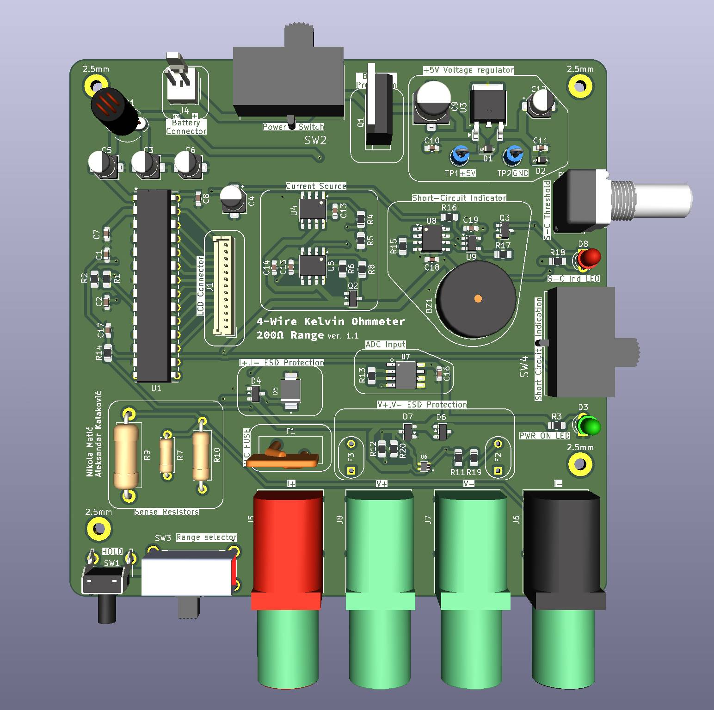

# Low-Resistance Meter (2–200 Ω)

This is my first project.

Portable digital ohmmeter designed for accurate low-resistance measurements. This project covers the full electronic system design, including schematic, pcb, enclosure and documentation.

Developed as a coursework project for **Design of Industrial Devices and Measurement Systems 1**.
---

---

## Technical Specifications

| Parameter | Specification |
| :--- | :--- |
| **Measurement Range** | 2 Ω, 20 Ω, and 200 Ω full-scale |
| **Current Source** | 1 mA, 10 mA, and 100 mA (switch-selectable) |
| **Display** | $3\frac{1}{2}$-digit multiplexed LCD (VIM-503-DP-RC-S-HV via MAX1491) |
| **Power Supply** | Single 9 V battery (BT1) with internal +5 V regulation (LM78M05) |
| **Measurement Method** | 4-wire (Kelvin) sensing |
| **Form Factor** | 2-layer $100 \times 100\text{ mm}$ SMD PCB |

